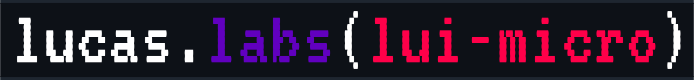

<p align="center"></p>

<p align="center">
<strong>
🔎 <code>lucas-labs/lui-micro</code> SCSS library.
</strong>
</p>

<br/>
<br/>

## TODO
#### Componentes
- [ ] Cards component ? (`<article>`?)
- [ ] Loading component 
- [ ] Skeleton component

La idea es que los componentes sean opcionales.
Debería haber un nuevo param en el init en el que pueda desactivar componentes uno a uno. Ejemplo:

```scss
@use '~@lucas-labs/lui-micro' as lui;
@include lui.init(
    $components: (
        cards: false,
        loading: false,
        skeleton: true
    )
);
```

## 📄 Documentation

### 📦 Install

Download with NPM/PNPM/YARN:

`pnpm i @lucas-labs/lui-micro`
`npm i @lucas-labs/lui-micro`
`yarn add @lucas-labs/lui-micro`

Then import it in your `.scss` file:

```scss
@use '~@lucas-labs/lui-micro' as lui;
@include lui.init();
```

### ⚙️ Options
The `lui.init` mixin can receive several params:

* `$theme`: default theme configuration map. This will be used instead of the prebuilt theme. It doesn't need to be a complete theme, as `lui` will merge it with the default prebuilt if there are missing variables.
* `$breakpoints `: media-breakpoints for grid-system and breakpoint utilities.
* `$options`: map with options for the library. It can have the following keys:
  * `reboot`: boolean. If `true`, the reboot will be applied. Default: `true`.
  * `common`: boolean. If `true`, the common styles will be applied. Default: `true`.
  * `theme`: boolean. If `true`, the theme will be applied. Default: `true`.
  * `merge-theme-with-prebuilt`: boolean. If `true`, the theme will be merged with the default theme. If you choose not to merge it, you will need to provide all the necesary variables. Default: `true`.
  * `color-utilities`: boolean. If `true`, color utilities will be created. Default: `false`.
  * `form`: boolean. If `true`, the form styles will be created. Default: `false`.
  * `themed-form`: boolean. If `true`, the themed form styles will be created (color classes for buttons, etc). Default: `false`.
  * `form-alt`: boolean. If `true`, the form-alt styles (sliders, color selection, etc) will be created. Default: `false`.
  * `themed-form-alt`: boolean. If `true`, the themed form-alt styles (color classes for primary color, etc) will be created. Default: `false`.
  * `layouts`: map containing:
    * [`grid`](#grid-options): boolean|map. If `true`, the grid system will be created. If it's a map, it will be passed to the grid system mixin as option. Default: `false`.
    * [`container`](#container-options): boolean|map. If `true`, the containers/container-fluid styles will be created. If it's a map, it will be used as options. Default: `false`.
  * `[utilities`](#utilities-options): boolean|map. If `true` or map defined, the utility classes will be created.  
    If true, all utilities will be created. If map, only the utilities defined in the map will be created.

> 💡 All parameters are optional! (defaults will be used)

#### Utilities options

* `float`: boolean (true indicates the utility classes should be created)
* `display`: boolean (true indicates the utility classes should be created)
* `position`: boolean (true indicates the utility classes should be created)
* `width`: boolean (true indicates the utility classes should be created)
* `height`: boolean (true indicates the utility classes should be created)
* `justify-content`: boolean (true indicates the utility classes should be created)
* `align-items`: boolean (true indicates the utility classes should be created)
* `align-content`: boolean (true indicates the utility classes should be created)
* `align-self`: boolean (true indicates the utility classes should be created)
* `order`: boolean (true indicates the utility classes should be created)
* `margin`: boolean (true indicates the utility classes should be created)
* `margin-x`: boolean (true indicates the utility classes should be created)
* `margin-y`: boolean (true indicates the utility classes should be created)
* `margin-top`: boolean (true indicates the utility classes should be created)
* `margin-end`: boolean (true indicates the utility classes should be created)
* `margin-bottom`: boolean (true indicates the utility classes should be created)
* `margin-start`: boolean (true indicates the utility classes should be created)
* `padding`: boolean (true indicates the utility classes should be created)
* `padding-x`: boolean (true indicates the utility classes should be created)
* `padding-y`: boolean (true indicates the utility classes should be created)
* `padding-top`: boolean (true indicates the utility classes should be created)
* `padding-end`: boolean (true indicates the utility classes should be created)
* `padding-bottom`: boolean (true indicates the utility classes should be created)
* `padding-start`: boolean (true indicates the utility classes should be created)
* `font-weight`: boolean (true indicates the utility classes should be created)
* `text-align`: boolean (true indicates the utility classes should be created)
* `visibility`: boolean (true indicates the utility classes should be created)

##### Example

```scss 
$utilities: (
    // only visibility utilities will be created
    visibility: true,
)
```

#### Grid options
* `grid-classname`: Default: `'grid'`

* `column-classname`: Default: `"col"`

* `columns`: Default: `(12)`

* `gap`: Default: `0px`

* `prefix`: Default: `` (prefix for the css variables)

#### Container options
* `gutter`: Default: `1.5rem`
* `max-widths`: Default: 

    ```scss
    $max-widths: (
        sm: 540px,
        md: 720px,
        lg: 960px,
        xl: 1140px,
        xxl: 1320px
    )
    ```

* `prefix`: Default: `` (prefix for the css variables)


### Mixins

#### Vars and colors
The library includes some mixins that can be used to access theme variables and colors

```scss
@use '@lucas-labs/lui-micro/color';
@use '@lucas-labs/lui-micro/var';

.my-div {
    background-color: color.get('primary'); // background-color: var(--c-primary);
    color: color.get('primary', 'rgb'); // color: var(--c-primary-rgb);

    // it works with nested colors too
    // provided you defined your nested theme-color as 
    // colors: (
    //     my: (
    //         nested: (
    //             color: #000,
    //         )    
    //     )
    // )
    border-color: color.get('my/nested/color'); // border-color: var(--c-my_nested_color);
    // dots instead of slashes can be used too
    border-color: color.get('my.nested.color'); // border-color: var(--c-my_nested_color);


    // get a theme variable
    border-radius: var.get('font-family'); // border-radius: var(--v-font-family);
    
    // as with colors, it works with nested variables too
    // provided you defined your nested variable as
    // variables: (
    //     my: (
    //         nested: (
    //             variable: 10px,
    //         )
    //     )
    // )
    border-radius: var.get('my/nested/variable'); // border-radius: var(--v-my_nested_variable);
}
```

#### Breakpoints

The library includes several mixins to help you create responsive layouts and styles.

```scss
@use '@lucas-labs/lui-micro/bp';

// @use '@lucas-labs/lui-micro/bp' with (
//     $breakpoints: ( sm: 576px, ... )
// );

.my-div {
    // create a breakpoint
    @include bp.up('sm') {
        // styles for sm and up
    }

    @include bp.down('sm') {
        // styles for sm and down
    }

    @include bp.only('sm') {
        // styles for sm only
    }

    @include bp.between('sm', 'md') {
        // styles for sm and md
    }

    @include bp.not('sm') {
        // styles for everything but sm
    }

}
```
#### Containers

The library includes a mixin to create responsive containers

```scss
@use '@lucas-labs/lui-micro/layouts';
// @use '@lucas-labs/lui-micro/layouts' with (
//     $breakpoints: ...;
//     $gutter: ...;
//     $prefix: ...;
//     $max-widths: ...;
// );

.my-own-container {
    @include layouts.container(
        $max-widths: (
            sm: 250px,
            md: 500px,
            lg: 750px,
        ),
        $breakpoints: (
            sm: 400px,
            md: 550px,
            lg: 1000px,
        )
    );
}
```

### 🎨 Theme / Customization 

You can create any number of themes, but one of them needs to be the default theme.

#### Breakpoints
To set the breakpoits for the library to use, you need to pass a map to the $breakpoints parameter in the `lui.init` mixin:

```scss
@use '~@lucas-labs/lui-micro' as lui;
@include lui.init(
    $breakpoints: (
        xs: 0px,
        sm: 576px,
        md: 768px,
        lg: 992px,
        xl: 1200px,
    )
);
```
#### Setting default theme
You can set a default theme by passing a map object as a parameter to the `lui.init` mixin or by using the theme creation utility.

- Using `init` mixin example:

```scss
@use '~@lucas-labs/lui-micro' as lui;
@include lui.init(
    $theme: (
        colors: (
            primary: yellow,
        ),
    )
);
```

> 💡 You can see an example of all posible theme variables [here](./src/theme/_prebuilt.scss).

- Using theme-creation utility:

```scss
@use '~@lucas-labs/lui-micro' as lui;
@use '~@lucas-labs/lui-micro/theme' as theme;

@include lui.init();
@include theme.create-theme(
    $theme: (
        ...
        colors: (
            background: ...,
            text: ...,
            primary: ...,

            // nested maps are allowed (also allowd for variables)
            grouped: (
                a-nested-color: #fff,
                even-more-nested: (
                    ...
                ),
            )
            ...
        ),
        ...
    )
    $as-default: true // set as-default as true, so lui defaults to this theme
                      // this theme will be also used as a base for when you 
                      // create a new theme
);
```

#### Setting default theme
By using the create-theme utility you can also create themes as non-default themes. This means you'll be able to change between themes at runtime. This is possible because themes are made of css variables.

```scss
@use '~@lucas-labs/lui-micro' as lui;
@use '~@lucas-labs/lui-micro/theme' as theme;

// setting a deault theme called "light"
@include lui.init(
    $theme: (
        name: "light",
        ...
    )
);

// creating another theme called "dark" that will not be default
@include theme.create-theme(
    $theme: (
        name: "dark"
        ...
    )
    // don't pass $as-default here, or pass it as "false"
);
```

Now to change themes at runtime, you'll need to set a variable on your <html> tag:

```html
<html theme="dark"> 
...
</html>
```

To change it back to de default, either you set the `theme` attribute to its name, or remove the theme attribute from the html tag (it will default to the default theme):

```html
<html theme="light"> 
...
</html>
```

